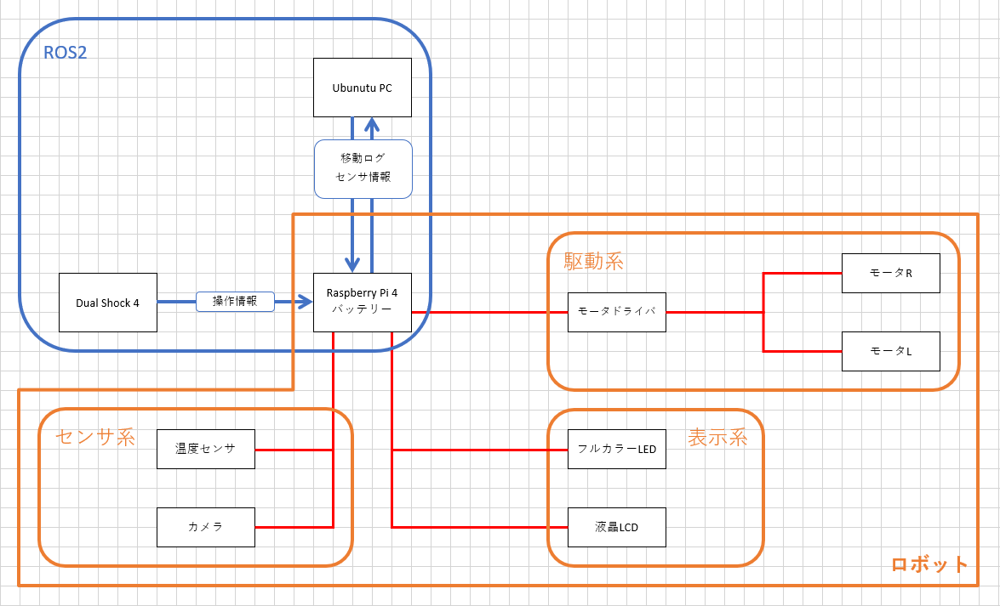

# ROS2ラジコン
## 目的
自己研鑽．

## 目標
- ros2の基礎の習得
- ハードウェアとソフトウェア両面の技術のアップデート

## 仕様
### 全体仕様

### 

## 各系統について
### ROS2
- パッケージの作成
- pub-sub通信の理解
公式チュートリアルを参考にする．
#### DualShock4-RaspberryPi4通信
調査中...
#### raspi4-PC通信
調査中...
### ロボット全体
#### GPIO制御
pigpioを使用．下記参照
https://qiita.com/NeK/items/da429f8c001476ec4544
まずはLチカ(単色・非PWM)→Lチカ(単色・PWM)→Lチカ(RGB)→ROS2制御
そのあとモータドライバ制御へ
### 表示系
#### フルカラーLED
使用LED
https://akizukidenshi.com/catalog/g/gI-02476/
参考URL
https://www.souichi.club/raspberrypi/color-led/
- 
